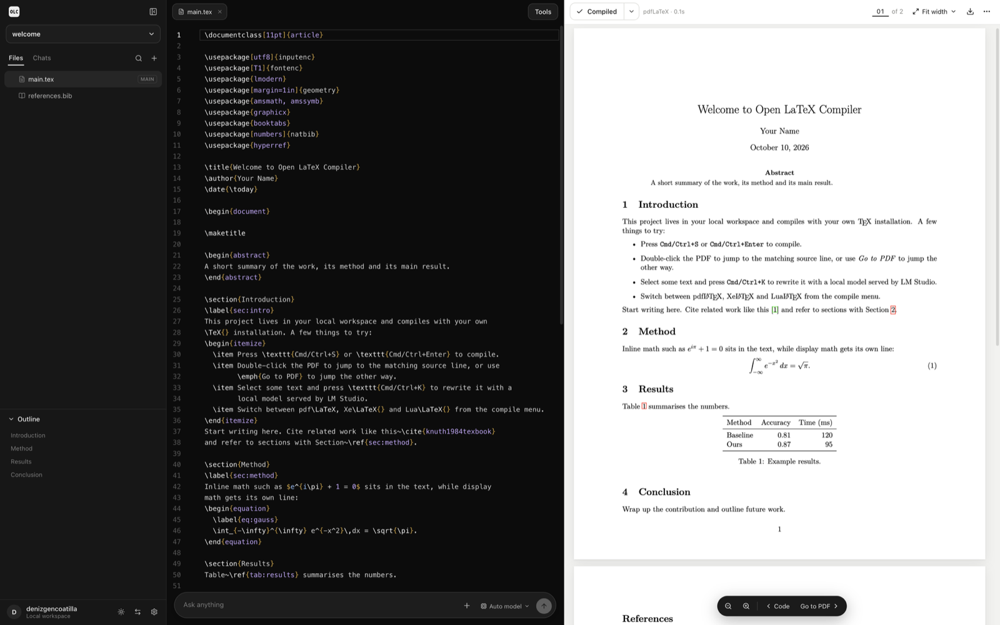

# open-latex-compiler

<p align="center">
  
</p>

A local LaTeX editor in the spirit of Overleaf and OpenAI Prism. Everything runs on your machine: files stay on your disk, documents compile with your own TeX installation, and the writing assistant talks to a local model served by LM Studio, Ollama or any other OpenAI-compatible server.

- **Three-pane workspace:** a file panel (left or right), the editor, and a live PDF preview, each resizable
- **Compilers:** pdfLaTeX, XeLaTeX, LuaLaTeX, LaTeX → DVI → PDF and Tectonic. Auto-detect honours `% !TEX program = …` and picks XeLaTeX when the preamble loads `fontspec`.
- **PDF preview:** continuous scrolling, zoom presets, Ctrl/⌘ + scroll or pinch to zoom, page jump, a dark PDF mode, and download
- **SyncTeX:** double-click the PDF to jump to the source line. *Go to PDF* jumps from the cursor to the PDF.
- **Editor:** LaTeX and BibTeX highlighting, autocomplete for commands and environments, `\ref` labels, `\cite` keys and file paths, find and replace, inline error markers, outline, and project-wide search
- **Logs:** errors, warnings and bad boxes grouped by type, each linked to its source line, with *Ask AI to fix*
- **Local AI:**
  - Select text and press ⌘K to rewrite it, with a word-level diff to accept or discard
  - Press ⌘K with no selection to generate LaTeX at the cursor
  - A chat that sees the open file. LaTeX blocks in replies can be inserted into the document.
- **Projects:** create one from a template (article, IEEE, Beamer, thesis, XeLaTeX), import an Overleaf `.zip`, open any existing folder in place, or export as `.zip`

## Requirements

- Node.js 20 or newer
- A TeX distribution: [MacTeX](https://www.tug.org/mactex/) or TeX Live (with `latexmk`), or [Tectonic](https://tectonic-typesetting.github.io/)
- Optional: [LM Studio](https://lmstudio.ai/) or another OpenAI-compatible server for the AI features

## Getting started

```sh
npm install
npm run app      # build the UI and start the app at http://localhost:4747
```

After the first build, `npm start` starts the app without rebuilding. `npm run dev` runs it with hot reload while you work on Open LaTeX Compiler itself.

The first run creates a `welcome` project in `~/LatexCompile`. You can change the workspace folder in **Settings → General**.

### Connecting LM Studio

1. In LM Studio, download a model (for example Qwen3, Gemma 3 or gpt-oss) and open the **Developer** tab.
2. Click **Start Server**. The default address is `http://localhost:1234/v1`.
3. In Open LaTeX Compiler, open **Settings → AI models**, click **Test**, and pick a model. Leave the model on *Auto* to use the first model available.

Ollama (`http://localhost:11434/v1`), llama.cpp, vLLM and Jan have presets. Any other OpenAI-compatible endpoint works through *Custom*. Reasoning output (`reasoning_content` or `<think>` tags) shows up in a collapsible *Reasoning* section.

## Keyboard shortcuts

| Action | Shortcut |
| --- | --- |
| Compile | ⌘/Ctrl + Enter |
| Save and compile | ⌘/Ctrl + S |
| AI edit (with a selection) or generate (without one) | ⌘/Ctrl + K |
| Send the selection to chat | ⌘/Ctrl + L |
| Bold / italic | ⌘/Ctrl + B / I |
| Toggle comment | ⌘/Ctrl + / |
| Find and replace | ⌘/Ctrl + F |
| Show or hide the file panel | ⌘/Ctrl + Alt + B |
| Jump from the PDF to the source | double-click the PDF |

## Where things live

| What | Where |
| --- | --- |
| Projects | `~/LatexCompile/<project>` (or any folder opened with *Open folder*) |
| Build output (aux files, PDFs, SyncTeX) | `~/.latexcompile/cache/<project-id>` |
| Settings, chats | `~/.latexcompile/config.json`, `~/.latexcompile/chats/` |
| Deleted files and projects | `~/.latexcompile/trash/` |

Builds happen outside the project folder, so your sources stay free of `.aux` and `.log` clutter. Set `LATEXCOMPILE_WORKSPACE`, `LATEXCOMPILE_HOME` or `PORT` to override the defaults.

## Security notes

- The server only listens on `127.0.0.1` and rejects cross-origin requests.
- Shell escape is off by default; TeX keeps its restricted mode, so `epstopdf` still works. Turn it on per project only for documents you trust, since it lets a document run commands.
- latexmk reads a `latexmkrc` in the project folder, as it does on the command line.

## Project layout

```
server/        Express API: projects, files, compilation (latexmk), log parsing, SyncTeX, LLM proxy
src/           React UI
  editor/      CodeMirror 6 setup, LaTeX/BibTeX languages, completions
  pdf/         pdf.js viewer
  components/  Sidebar, editor pane, PDF pane, AI edit, chat, dialogs
  lib/         API client, state store, LLM streaming, outline and diff helpers
```

## Credits

Built by [@pathtix](https://github.com/pathtix) together with [Claude](https://www.anthropic.com/claude) (Anthropic), using Claude Code.

The interface is inspired by Overleaf and OpenAI Prism. Open LaTeX Compiler is an independent project and is not affiliated with, endorsed by or sponsored by OpenAI or Overleaf.
